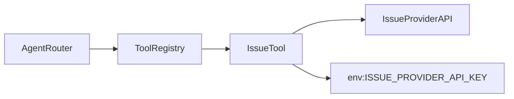
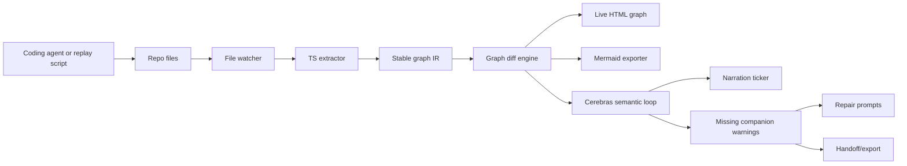

# Snitch

Background truth layer for AI coding agents.

Snitch installs into a coding session as a local companion. Agent hooks feed it events in the background, Snitch keeps durable `.snitch/` state, and the visual/Markdown surfaces update from the same graph IR. The demo should feel like the codebase is becoming visible at machine speed while the agent is still working.

## Current MVP

This repo now includes a working first slice:

- background CLI: `pnpm snitch init`, `event`, `status`, and `finalize`
- generated hook adapter at `.snitch/hooks/codex-hook.mjs`
- generated Codex, Claude Code, and OpenCode adapter configs with `--agent all`
- privacy-preserving local event log at `.snitch/events.jsonl`
- normalized event model with payload hashing and safe summaries
- narrow TypeScript extractor for real repo graph generation
- target-aware hook refresh: file-changing events regenerate code-derived artifacts
- local live server: `pnpm snitch watch` serves `.snitch` artifacts to the dashboard
- graph scope controls for all, changed, and selected-warning impact views
- sponsor artifact lane: `pnpm snitch sponsors` writes Cerebras narration and Backboard repo-rule status
- scripted repair pass: `pnpm demo:repair` adds the missing companion work and regenerates warning-free artifacts
- one-command live demo runner: `pnpm demo:live`
- prepared demo assistant app under `apps/demo-app`
- deterministic graph IR, hashing, diffing, and last-good-graph behavior
- replayed issue-tool demo graph with missing companion warnings
- Mermaid, handoff, timeline, graph JSON, and PR-comment artifact generation
- Cerebras and Backboard sponsor lanes with graceful fallback behavior
- Vite/React dashboard using React Flow for the live graph surface

See [docs/strategy-2026-06-27.md](docs/strategy-2026-06-27.md) for the researched next build direction.

## Run It

```bash
pnpm install
pnpm demo:live
```

`pnpm demo:live` prepares code-derived artifacts, writes sponsor status, starts `snitch watch` at `http://127.0.0.1:4767`, and starts the dashboard pointed at that local server. Plain `pnpm dev` stays in clean replay fallback mode. The first screen is the Snitch inspection surface: live graph, warning rail, timeline, sponsor lane, and PR artifact preview.

Useful commands:

```bash
pnpm snitch init --agent all --target apps/demo-app --task "Watch this coding-agent session"
printf '{"tool_name":"apply_patch","file_path":"src/tools/create-issue.ts"}' | pnpm snitch event --source codex --hook PostToolUse
pnpm snitch analyze --target apps/demo-app --task "Add an external issue-creation tool"
pnpm snitch sponsors --offline
pnpm snitch sponsors
pnpm snitch watch --port 4767
pnpm dev:live
pnpm demo:live --offline-sponsors
pnpm demo:repair
pnpm snitch status
pnpm snitch finalize
pnpm test
pnpm build
pnpm verify:browser
pnpm demo:artifacts
pnpm demo:extract
pnpm smoke:cerebras
pnpm smoke:backboard
```

Local credentials live in `.env`; `.env.example` lists the supported keys. `CEREBRAS_MODEL` can be a public model ID such as `gpt-oss-120b` or an org dedicated endpoint ID when available.

## Background Agent Setup

Snitch follows the Flow Guardian pattern: small local config, durable handoff state, no GitHub write powers inside the agent loop.

After `pnpm snitch init --agent all`, Snitch writes:

- `.codex/hooks.json`
- `.claude/settings.local.json`
- `.opencode/snitch-plugin.ts`
- `.snitch/hooks/codex-hook.mjs`

The generated hook command is:

```bash
node .snitch/hooks/codex-hook.mjs <hook-name>
```

The generated adapter calls back into this Snitch checkout and records:

- source and hook name
- payload hash and byte count
- safe event summary keys such as tool name, file path, command hash/byte count, status, or exit code

It does not store the raw hook payload. File-changing events refresh the configured TypeScript target and regenerate:

- `.snitch/graph.json`
- `.snitch/warnings.json`
- `.snitch/timeline.jsonl`
- `.snitch/mermaid.mmd`
- `.snitch/handoff.md`
- `.snitch/pr-comment.md`
- `.snitch/sponsors.json`

`pnpm snitch watch` exposes:

- `GET /health`
- `GET /api/state`
- `GET /api/events` for Server-Sent Events

`pnpm demo:repair` is the stage-two demo move: it patches `apps/demo-app` with the audit log, secret redactor, scoped permission contract, and unauthorized-call test, then regenerates `.snitch` artifacts. After a live dashboard is running, this is the moment where the warning rail collapses to "No active Snitch warnings."

For code-derived artifacts, run:

```bash
pnpm snitch analyze --target apps/demo-app --task "Add an external issue-creation tool"
```

`snitch analyze` is also useful as a one-shot artifact refresh; it persists the target so later hook events can keep using it. If the target cannot be extracted yet, Snitch keeps the last valid graph and can fall back to the replay sequence. The current extractor recognizes the demo assistant router, tool registry, `create_issue` tool, input schema, provider `fetch`, provider credential, and missing audit/redaction/permission/test companions.

## Demo Thesis

The wow is not "AI generated docs." The wow is:

> The agent changes code on the left, and the system map changes on the right before a human could read the diff.

The fastest path to a strong demo is a split screen:

- Left: a real coding agent editing a prepared TypeScript app.
- Background: Snitch hook adapter capturing the agent's session events.
- Right: Snitch showing the live API/tool/data-flow graph, a fast narration ticker, and generated Mermaid/HTML diagrams.

The room should watch nodes and edges appear as the agent works: endpoint, schema, tool, env var, external API, database write, test, missing companion. The final diff is secondary. The live morphing graph is the product.

## Positioning

Snitch is for every builder using AI coding agents. It should not be framed as an 8090-only tool or a sponsor-specific add-on.

Task sources can be:

- plain prompt
- GitHub issue
- Linear ticket
- README/spec file
- 8090 Software Factory Work Order
- any MCP resource that describes intended work

8090 is an optional rich task-source adapter. The core product is local-first and agent-agnostic.

## Sponsor Use

Use sponsors where they make the demo visibly better.

### Cerebras

Cerebras should be load-bearing for speed:

- turn graph diffs into instant human narration
- generate/update Mermaid summaries quickly
- rank what changed as important
- infer missing companion pieces from the task and graph
- generate repair prompts from warnings

The deterministic parser owns truth. Cerebras owns speed-of-meaning.

### Backboard

Backboard is optional but useful if time allows:

- remember repo conventions and accepted architecture rules
- remember false positives
- store session handoff state
- make warnings repo-aware instead of generic

Example: "This repo requires audit logging for external tools" is stronger than "tools often need audit logging."

### 8090 Software Factory

8090 should be an adapter, not the identity:

- import a Work Order as a task source
- read linked requirements/blueprints when available
- export Snitch's evidence as a work-order handoff or status note

The pitch: "If your team uses Software Factory, Snitch can use its Work Orders as richer intent. If not, paste a prompt or GitHub issue."

### Docker

Docker is useful for demo reliability:

- reproducible demo app
- predictable agent sandbox
- one-command local run

It is not the product hook.

## Primary Demo Scenario

Use an AI-builder-native task, not a generic payment demo.

Task:

> Add an external issue-creation tool to this coding assistant. It should validate the request, call the issue provider, and expose the tool through the assistant's registry.

Expected live graph:



Expected contract rail:

- Tool registry created
- Issue tool registered
- Provider credential referenced
- Secret redaction present
- Tool calls audit logged
- Tool access scoped per task/session
- Unauthorized tool-call test exists

Killer demo beat:

> The agent says the tool is done. Snitch shows the system gained a broad external capability, but no audit trail, no secret redaction, and no per-task permission boundary.

Clicking a warning should produce a repair prompt the user can send back to the coding agent.

## Visual Surfaces

Build two visual surfaces with different jobs.

### 1. Live HTML Graph

This is the stage wow.

- stable animated graph
- nodes and edges move without layout thrash
- new nodes scale/fade in
- new edges draw on
- important changes glow briefly
- graph never blanks when code is temporarily unparseable

Use this for the live agent demo.

### 2. Mermaid / Fast Docs

This is the shareable artifact.

- regenerated Mermaid diagrams from the same graph IR
- copyable `.mmd` output
- HTML preview pane for docs
- useful for handoff, README updates, PR comments, and 8090/Backboard exports

Do not rely on Mermaid as the primary live animation surface unless research proves it can update smoothly without full re-layout flicker.

## Architecture



Core rule: the parser and graph IR are the source of truth. LLM output can label, summarize, rank, and infer gaps, but it should not invent the graph.

## Graph IR

Everything should pass through one stable, diffable intermediate representation.

```ts
type GraphNodeKind =
  | "endpoint"
  | "schema"
  | "service"
  | "tool"
  | "env"
  | "external"
  | "database"
  | "test"
  | "contract";

type GraphNode = {
  id: string;
  kind: GraphNodeKind;
  label: string;
  file?: string;
  line?: number;
  meta?: Record<string, unknown>;
  hash: string;
};

type GraphEdge = {
  id: string;
  from: string;
  to: string;
  kind: "calls" | "validates" | "reads" | "writes" | "uses_secret" | "covers" | "satisfies" | "violates";
  hash: string;
};
```

Stable IDs are non-negotiable:

- endpoint: `endpoint:POST:/api/issues`
- tool: `tool:IssueCreationTool`
- env: `env:ISSUE_PROVIDER_API_KEY`
- external: `external:issue-provider`
- schema: `schema:CreateIssueInput`

Never ID by array index, screen position, or line number.

## First Build Order

Build the wow first, then make it real.

1. Hardcoded before/after graph IRs.
2. Diff engine with stable node IDs.
3. Live HTML graph that animates only deltas.
4. Mermaid exporter from graph IR.
5. Replay script that applies prepared file changes every few seconds.
6. File watcher wired to graph updates.
7. Narrow TypeScript extractor for the prepared demo app.
8. Cerebras narration and missing-companion loop.
9. Real coding agent run on the same task.
10. Hot fallback: replay script that looks identical to the real run.
11. Optional adapters: 8090 task import, Backboard memory, Dockerized demo.

The real agent is impressive, but the replay path protects the stage demo.

## Latency Targets

These are demo targets, not production promises.

- file change to graph update: under 300 ms when extraction succeeds
- file change to Mermaid refresh: under 1000 ms
- graph diff to narration: under 1000 ms
- no full graph blanking on parse errors
- no global graph re-layout on every update

If narration lags, render the graph immediately and let text catch up.

## Repo Shape To Build Toward

```text
apps/
  web/                 # Snitch dashboard
  demo-app/            # Prepared TS app the agent mutates
packages/
  graph/               # Graph IR, hashing, diffing
  extractor-ts/        # TS/Next/Zod/MCP-tool extraction
  watcher/             # chokidar + event pipeline
  cerebras/            # fast semantic calls
  mermaid/             # graph IR -> Mermaid
  replay/              # scripted demo edits
demos/
  mcp-tool-access/     # patches, prompts, expected beats
docs/
  research.md          # stack decisions and source notes
  hooks.md             # hook layers for live capture and PR publishing
```

Do not scaffold all of this before the first latency spike. This is the target shape, not step one.

## Research Queue

Research only the decisions that affect the first build.

1. Live graph rendering:
   - React Flow with controlled positions
   - custom SVG + ELK
   - D3 force with pinned existing nodes
2. Mermaid rendering:
   - Mermaid browser API
   - Mermaid CLI
   - whether incremental visual updates are realistic
3. TypeScript extraction:
   - `ts-morph`
   - raw TypeScript language service
   - `tree-sitter-typescript`
4. Watch pipeline:
   - `chokidar`
   - SSE vs WebSocket
   - debounce strategy for agent file storms
5. Agent demo input:
   - Codex / Claude Code / OpenCode local run
   - scripted patch replay fallback
6. Sponsor integrations:
   - Cerebras structured JSON response API shape
   - Backboard memory/R-CLI role
   - 8090 MCP work-order import/export shape
7. Hook integrations:
   - agent-runtime hooks for live capture
   - GitHub `pull_request` workflow for PR artifact publishing
   - local `.snitch/` state inspired by Flow Guardian handoff files

## Next Build Targets

1. Add a real file watcher and `snitchd` event stream.
2. Add a narrow TypeScript extractor for the prepared demo app.
3. Wire one agent runtime hook path.
4. Add a GitHub Action template that posts `.snitch/pr-comment.md`.
